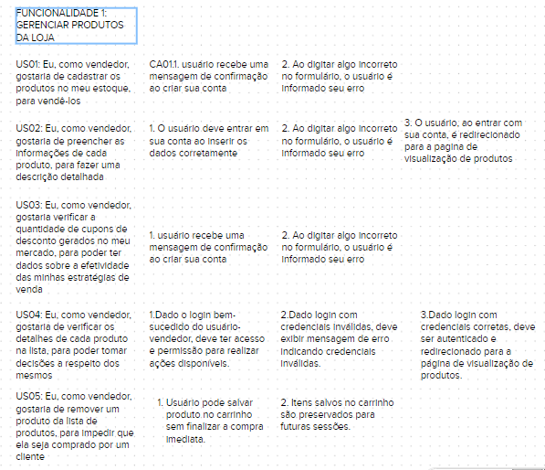
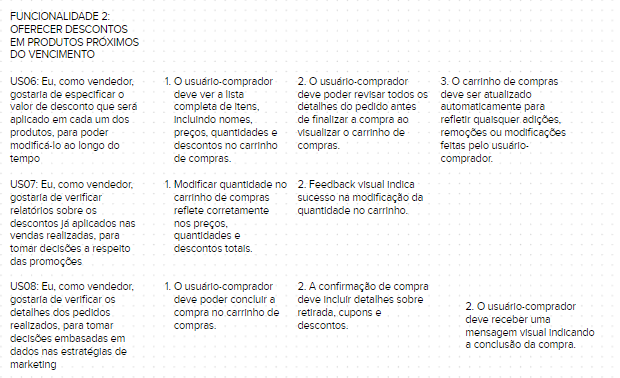
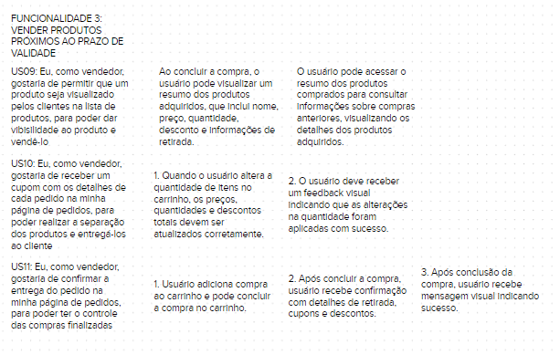
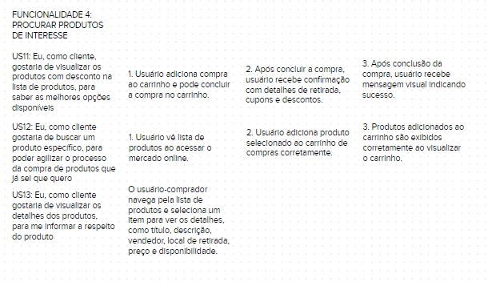
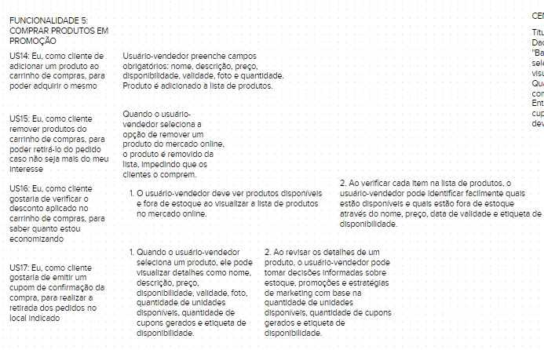
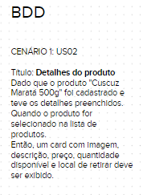
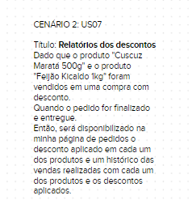
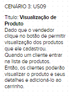
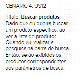

## BDD

<a href="https://app.mural.co/invitation/mural/charlesserafimmorais8192/1685913080687?sender=uf6ab60b0f576c6cf0a879828&key=4a0d91ee-5e02-4443-aba7-96d2aaefca59">Link do PBB Canvas</a>

## User Story

|  **Épico**  | **US** | **Descrição** | **Critérios de Aceitação** |
| :---------: | :-----------: | :---------:| :------------: |
| E1 |   US01   | Eu, como usuário-comprador, desejo criar minha conta, adicionando minhas informações pessoais, como nome, endereço de e-mail e senha, para poder usufruir de descontos exclusivos em produtos perto do vencimento |  1. Dado que o usuário-comprador preencheu corretamente todos os campos obrigatórios do formulário de criação de conta (nome, endereço de e-mail e senha) e clicar em "Criar Conta", o usuário deve receber uma mensagem de confirmação informando que sua conta foi criada com sucesso.  2. Dado que o usuário-comprador está na página de criação de conta, quando ele tentar enviar o formulário com algum campo preenchido incorretamente ou faltando informações, espero ver mensagens de erro específicas destacando quais campos foram preenchidos incorretamente ou estão faltando informações.|
| E1 |  US02    | Eu, como usuário-comprador, desejo fazer login na minha conta utilizando meu endereço de e-mail e senha, para que eu possa gerar cupom exclusivos para os produtos selecionados no carrinho de compras | 1. Dado que o usuário-comprador criou sua conta com sucesso, quando tentar fazer login usando o endereço de e-mail e a senha fornecidos durante o processo de criação, então deve ser capaz de acessar sua conta com sucesso e ter permissão para realizar as ações disponíveis para usuários autenticados. 2. Dado que o usuário-comprador está na página de login, quando insere um nome de usuário ou senha incorretos e clicar no botão de login, então deve receber uma mensagem de erro indicando que as credenciais são inválidas. 3. Dado que o usuário-comprador está na de login, quando insere o endereço de e-mail e a senha corretos e clicar no botão de login, então deve ser autenticado com sucesso e direcionado para a página de visualização de produtos.|
| E2 |  US03    | Eu, como usuário-vendedor, desejo criar minha conta, adicionando minhas informações pessoais, como nome, endereço de e-mail e senha, para poder aumentar minhas vendas e diminuir o desperdício dos meus alimentos perto do vencimento | 1. Dado que o usuário-vendedor preencheu corretamente todos os campos obrigatórios do formulário de criação de conta (nome, endereço de e-mail e senha) e clicar em "Criar Conta", o usuário deve receber uma mensagem de confirmação informando que sua conta foi criada com sucesso. 2. Dado que o usuário-vendedor está na página de criação de conta, quando ele tentar enviar o formulário com algum campo preenchido incorretamente ou faltando informações, espero ver mensagens de erro específicas destacando quais campos foram preenchidos incorretamente ou estão faltando informações.|
| E2 |  US04    | Eu, como usuário-vendedor, desejo fazer login na minha conta utilizando meu endereço de e-mail e senha, para que eu possa disponibilizar seus produtos no site e visualizar o andamento das minhas vendas | 1. Dado que o usuário-vendedor criou sua conta com sucesso, quando tentar fazer login usando o endereço de e-mail e a senha fornecidos durante o processo de criação, então deve ser capaz de acessar sua conta com sucesso e ter permissão para realizar as ações disponíveis para usuários autenticados. 2. Dado que o usuário-vendedor está na página de login, quando insere um nome de usuário ou senha incorretos e clicar no botão de login, então deve receber uma mensagem de erro indicando que as credenciais são inválidas. 3. Dado que o usuário-vendedor está na de login, quando insere o endereço de e-mail e a senha corretos e clicar no botão de login, então deve ser autenticado com sucesso e direcionado para a página de visualização de produtos.|
| E3 |  US05    | Eu, como usuário-comprador, quero ter a capacidade de salvar itens em meu carrinho para mais tarde, para que eu possa voltar a eles mais tarde sem perder minha seleção |1. Dado que o usuário-comprador está visualizando um produto disponível, quando ele deseja salvar o item em seu carrinho para mais tarde, então ele deve ter a opção de adicionar o produto ao carrinho, sem finalizar a compra imediatamente. 2. Dado que o usuário-comprador salvou itens no carrinho para mais tarde, quando ele retorna ao site em uma sessão futura, então os itens salvos anteriormente devem estar presentes no carrinho, preservando sua seleção anterior.|
| E3 |  US06    | Eu, como usuário-comprador, desejo visualizar meu carrinho e ver a lista de itens que adicionei, juntamente com seus preços, quantidades e descontos, para que eu possa revisar meu pedido antes de finalizar a compra| 1. Dado que o usuário-comprador tem itens adicionados no carrinho de compras, quando ele visualiza o carrinho, então ele deve ver a lista de itens adicionados, incluindo os nomes dos produtos, preços, quantidades e descontos aplicados. 2. Dado que o usuário-comprador está visualizando o carrinho de compras, quando ele revisa os detalhes do pedido, então ele deve poder ver todos os detalhes do pedido antes de finalizar a compra. 3. Dado que o usuário-comprador adicionou, removeu ou modificou itens no carrinho de compras, quando ele interage com o carrinho, então o carrinho de compras deve ser atualizado automaticamente para refletir as alterações feitas.|
| E3 |  US07    | Eu, como usuário-comprador, quero modificar a quantidade de itens do meu carrinho de compras, para que eu possa ajustar o pedido às minhas necessidades | 1. Dado que o usuário-comprador está visualizando o carrinho de compras, quando ele modifica a quantidade de itens no carrinho, então as alterações na quantidade devem ser refletidas corretamente nos preços, quantidades e descontos totais no carrinho. 2. Dado que o usuário-comprador modificou a quantidade de itens no carrinho, quando ele recebe um feedback visual, então ele deve ver uma mensagem indicando que as alterações na quantidade foram aplicadas com sucesso.|
| E3 |  US08    | Eu, como usuário-comprador, desejo finalizar a compra no meu carrinho e receber a confirmação de compra, contendo o lugar e horário de retirada do produto e o meus cupons, para que eu possa ir na loja física e retirar meus produtos | 1. Dado que o usuário-comprador está visualizando o carrinho de compras, quando ele já adicionou a compra, então ele deve ter a opção de concluir a compra no carrinho. 2. Dado que o usuário-comprador concluiu a compra no carrinho, quando ele recebe uma confirmação de compra, então a confirmação deve incluir detalhes sobre o local e horário de retirada dos produtos, bem como informações sobre os cupons aplicados e seus respectivos descontos. 3. Dado que o usuário-comprador concluiu a compra no carrinho, quando ele recebe uma mensagem de confirmação visual, então ele deve ver uma mensagem indicando que a compra foi concluída com sucesso.|
| E3 |  US09    | Eu, como usuário-comprador, desejo visualizar um resumo de cada um dos produtos comprados após finalizar a compra com sucesso, para que eu possa ter todas as informações necessárias para consultas futuras |1. Dado que o usuário-comprador concluiu com sucesso a compra, quando ele tem a opção de visualizar um resumo de cada produto comprado, então o resumo de cada produto deve incluir detalhes como nome, preço, quantidade, desconto aplicado e informações de retirada. 2. Dado que o usuário-comprador quer consultar informações sobre produtos comprados anteriormente, quando ele acessa o resumo dos produtos comprados, então ele deve poder ver os detalhes dos produtos adquiridos para consultas futuras.|
| E4 |  US10    | Eu, como usuário-comprador, desejo navegar pelos produtos disponíveis na lista de produtos cadastrados dentro do mercado on-line, para que eu possa acompanhar facilmente os produtos que estou interessado em comprar |1. Dado que o usuário-comprador está visualizando o carrinho de compras, quando ele modifica a quantidade de itens no carrinho, então as alterações na quantidade devem ser refletidas corretamente nos preços, quantidades e descontos totais no carrinho. 2. Dado que o usuário-comprador modificou a quantidade de itens no carrinho, quando ele recebe um feedback visual, então ele deve ver uma mensagem indicando que as alterações na quantidade foram aplicadas com sucesso.|
| E4 |  US11    | Eu, como usuário-comprador, desejo pesquisar produtos específicos, que estão presentes na lista de produtos cadastrados no mercado on-line, para que eu possa encontrar e selecionar rapidamente os itens que estou procurando|1. Dado que o usuário-comprador está visualizando o carrinho de compras, quando ele já adicionou a compra, então ele deve ter a opção de concluir a compra no carrinho. 2. Dado que o usuário-comprador concluiu a compra no carrinho, quando ele recebe uma confirmação de compra, então a confirmação deve incluir detalhes sobre o local e horário de retirada dos produtos, bem como informações sobre os cupons aplicados e seus respectivos descontos. 3. Dado que o usuário-comprador concluiu a compra no carrinho, quando ele recebe uma mensagem de confirmação visual, então ele deve ver uma mensagem indicando que a compra foi concluída com sucesso.|
| E4 |  US12    | Eu, como usuário-comprador, desejo adicionar os produtos, que estão na lista de produtos cadastrados no mercado on-line, no meu carrinho de compras, para que eu possa montar uma lista de produtos que eu desejo comprar com desconto | 1. Dado que o usuário-comprador está no mercado on-line, quando ele acessa a lista de produtos cadastrados, então ele deve ver a lista de produtos disponíveis. 2. Dado que o usuário-comprador está na lista de produtos disponíveis, quando ele seleciona um produto e o adiciona ao carrinho de compras,então o produto deve ser adicionado corretamente ao carrinho. 3. Dado que o usuário-comprador adicionou produtos ao carrinho de compras, quando ele visualiza o carrinho de compras, então os produtos adicionados devem ser exibidos corretamente. 4. Dado que o usuário-comprador adicionou produtos ao carrinho de compras, quando ele aperta o botão de adicionar, então ele deve ver uma mensagem indicando que os produtos foram adicionados com sucesso ao carrinho.|
| E4 |  US13    | Eu, como usuário-comprador, desejo visualizar os detalhes de um produto, incluindo título, descrição, vendedor do produto, local de retirada do produto, preço e disponibilidade, para que eu possa tomar uma decisão informada sobre a compra | Dado que o usuário-comprador está navegando pela lista de produtos, quando ele seleciona um produto específico, então ele deve ser capaz de visualizar os detalhes do produto, incluindo título, descrição, vendedor, local de retirada, preço e disponibilidade.|
| E4 |  US14    | Eu, como usuário-vendedor, quero poder adicionar novos produtos ao mercado online, incluindo nome, descrição, preço, disponibilidade, validade, foto e quantidade, para que potenciais clientes possam vê-los e comprá-los|Dado que o usuário-vendedor deseja adicionar um novo produto ao mercado online, quando ele preenche os campos obrigatórios, como nome, descrição, preço, disponibilidade, validade, foto e quantidade, então o produto deve ser adicionado com sucesso à lista de produtos.|
| E4 |  US15    | Eu, como usuário-vendedor, quero poder retirar um produto do mercado online, caso ele não esteja mais disponível ou caso eu decida descontinuá-lo, para que os clientes não possam comprá-lo |Dado que o usuário-vendedor deseja retirar um produto do mercado online, quando ele seleciona a opção de remover o produto da lista,então o produto deve ser removido com sucesso da lista de produtos, impedindo que os clientes possam comprá-lo.|
| E4 |  US16    | Eu, como usuário-vendedor, quero visualizar tanto os produtos disponíveis quanto os produtos fora de estoque dentro da lista de produtos com o nome, preço, data de validade e a etiqueta de disponível ou não, para que eu possa administrar meus produtos  |1. Dado que o usuário-vendedor está gerenciando seus produtos no mercado online, quando ele visualiza a lista de produtos, então ele deve poder ver tanto os produtos disponíveis quanto os produtos fora de estoque. 2. Dado que o usuário-vendedor está visualizando a lista de produtos, quando ele verifica cada item, incluindo nome, preço, data de validade e a etiqueta de disponibilidade, então ele pode identificar facilmente quais produtos estão disponíveis e quais estão fora de estoque.|
| E4 |  US17    | Eu, como usuário-vendedor, desejo visualizar os detalhes de cada um dos meus produtos, que estão na lista de produtos, incluindo nome, descrição, preço, disponibilidade, validade, foto, quantidade de unidades disponíveis, quantidade de cupons gerados e etiqueta de disponível ou não, para que eu possa tomar decisões sobre o estoque, promoções e estratégia de marketing |1. Dado que o usuário-vendedor deseja obter informações detalhadas sobre um produto específico que está na lista de produtos, quando ele seleciona o produto, então ele deve ser capaz de visualizar os detalhes do produto, incluindo nome, descrição, preço, disponibilidade, validade, foto, quantidade de unidades disponíveis, quantidade de cupons gerados e etiqueta de disponibilidade. 2. Dado que o usuário-vendedor está revisando os detalhes de um produto específico, quando ele verifica as informações, como quantidade de unidades disponíveis, quantidade de cupons gerados e a etiqueta de disponibilidade, então ele pode tomar decisões informadas sobre o estoque, promoções e estratégias de marketing relacionadas ao produto.|

## Histórico de versões

|  **Data**  |**Versão** |              **Descrição**                     |   **Editores**   |
| :--------: | :-------: | :-------------------------------------------------------: | :---------------: |
| 20/06/2023 |   `1.0`   | Criado                                  | Lucas e Charles   |