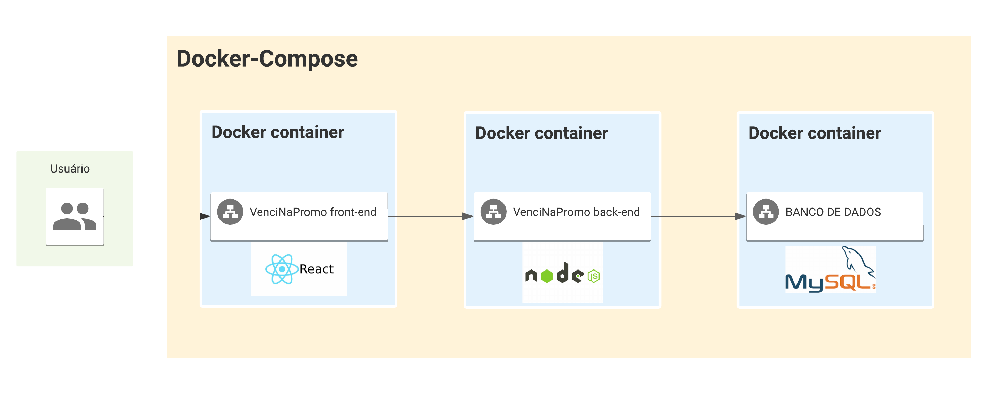

# Documento de Arquitetura e Interface

## Visão Geral da Arquitetura

A Figura 1 apresenta a visão geral da arquitetura do projeto, representando todos os serviços e suas relações.

<figcaption>
Figura 1 - Diagrama de Visão Geral da Arquitetura
</figcaption>

## Serviços

- Frontend:
Para o frontend, optaremos por utilizar uma arquitetura do tipo Single Page Application (SPA), seguindo o padrão Component-Based Architecture, com base na estrutura de desenvolvimento web React. Essa escolha foi feita devido à ampla utilização no mercado e aos benefícios que essa arquitetura oferece, como uma experiência de usuário aprimorada em termos de fluidez e responsividade, facilidade de reutilização de código, modularidade e facilidade de manutenção.

- Backend:
No backend, adotaremos a arquitetura em camadas padrão MVC (Model, View, Controller). Essa arquitetura é amplamente utilizada no mercado e foi escolhida devido à familiaridade da maioria da equipe com ela.

## Tecnologias

### React

React é uma biblioteca JavaScript de código-aberto para construção de interfaces de usuário.

### Node.js

Node.js é um ambiente de tempo de execução JavaScript de código aberto e multiplataforma.

### MySQL

MySQL é um sistema gerenciador de banco de dados relacional.

### Docker

Docker é uma plataforma de código aberto para criação e administração de ambientes isolados.

O Docker Compose é uma ferramenta para definir e executar aplicativos Docker de vários contêineres.

## Interface do projeto

lorem ipsun

### Paleta de cores
| Cor          | Código  |
| ------------ | :-----: |
| Branco       | #FFFFFF |
| Preto        | #232323 |
| Cinza        | #DFE1E5 |
| Cinza escuro | #818594 |
| Roxo         | #834DF0 |
| Amarelo      | #FFAF0F |
| Vermelho     | #DB3B4B |
| Azul         | #3574F0 |
| Verde        | #208A3C |

## Histórico de revisão
|   Data   | Versão | Descrição            | Autor   |
| :------: | :----: | -------------------- | ------- |
| 08/05/23 |  1.0   | Criação do documento | Todos   |
| 15/05/23 |  1.1   | Adição arquitetura    | Cainã |
